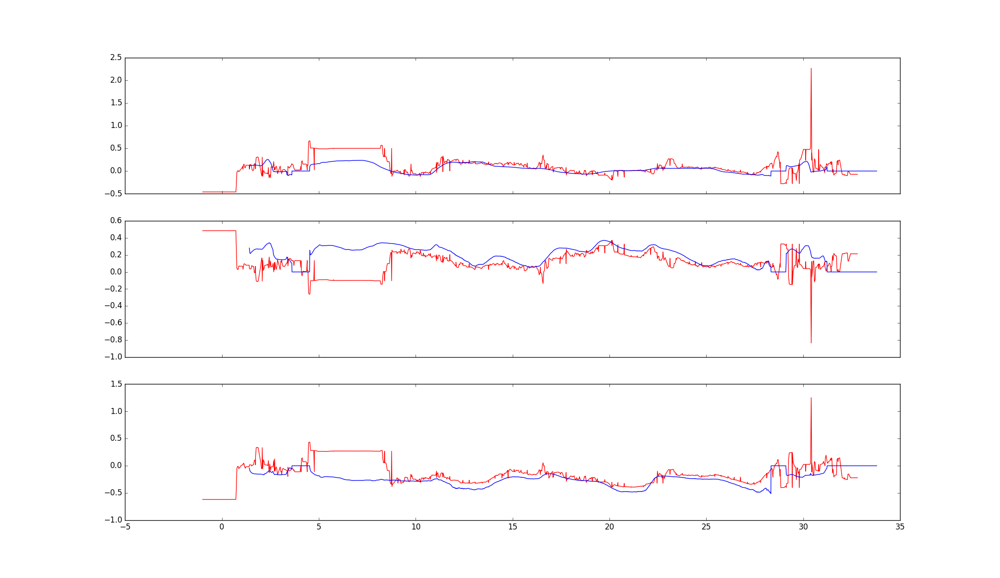

# Hand Tracking
3D human hand tracking

The repo contains Dockerfile with all the requirements installed specifically for estimating the hand pose from a rosbag or live with a camera.

It will use the *dockerfile/create_avc_transformations* code to get the transformation from the camera frame to the marker on the table and then it will use the [hand pose estimatior]([https://github.com/FORTH-ModelBasedTracker/MonocularRGB_3D_Handpose_WACV18]) to estimate the pose.

This has initially been set up to estimate the hand pose in the RALLI dataset.

## Running the container
### Using prebuilt image (recommended)
------------------
Prebuilt image can be found [here](https://hub.docker.com/r/jamadi/handtracking)
```bash
docker pull jamadi/handtracking:latest
```
### Bulding from docker file
--------------
Pull the repo and open terminal in dockerfile directory, and build the image.
````bash
docker build --network host -t hand-tracker-ralli .
````
Run the container and add the repo and dataset files.
```bash
docker run --runtime=nvidia -it --network=host -e DISPLAY=$DISPLAY -v /usr/lib/nvidia-(version installed):/usr/lib/nvidia-(version installed) -v /usr/lib32/nvidia-(version installed):/usr/lib32/nvidia-418 -v /tmp/.X11-unix/:/tmp/.X11-unix -v /path/to/repo:/code -v /path/to/rosbags:/dataset -w /code --privileged hand-tracker-ralli bash
```

or

```bash
nvidia-docker run -it --network=host -e DISPLAY=$DISPLAY -v /usr/lib/nvidia-(version installed):/usr/lib/nvidia-(version installed) -v /usr/lib32/nvidia-(version installed):/usr/lib32/nvidia-418 -v /tmp/.X11-unix/:/tmp/.X11-unix -v /path/to/repo:/code -v /path/to/rosbags:/dataset -w /code --privileged hand-tracker-ralli bash
```

## Simple-ros-wrapper Usage
*simple-ros-wrapper.py* will subscribe to a given camera topic expecting image messages, and will publish XYZ for all the joints as a __float32MultiArray__ message which must be reshaped to (21,3). 

```bash
python3 simple-ros-wrapper.py "camera/topic/" "desired/output/topic/name"
```  

## Handpose Usage

```bash
QT_X11_NO_MITSHM=1 python3 handpose.py
```
The *handpose.py* code is just to test the pose estimator ability with a webcam or video file ( see the main function in the file for instruction on how to use it)

## Annotator Usage

```bash
python annotator.py -b /path/to/rosbag.bag --delay {time-offset}
```

### Arguments

| Argument name        |     Description       | Default value  |
|:-------------:|:-------------:|:-----:|
|   bag  | Path to experiment bag | /dataset/AnnotationExperiment1.bag |
| display    | visualization using opencv      |   1 |
| save_path | path to the __folder__ to save the csv file ( csv file name will be "{bag name}-result.csv" )     |  results/   |
| transform | path to a transformation pickle file | None|
| delay | the Delay between the recordings | 0.0

## Plotter usage
The *plotter/plotter-xyz-wrist.py* is a simple comparison tool. it will plot the XYZ of wrist joint over time. To use it just give it the two CSV files as arguments
```bash
python plotter/plotter-xyz-wrist.py /path/to/baseline.csv /path/to/result.csv
````


*comparator output for experiment 1. __red line__ is the hand tracker result and the __blue line__ is the baseline using LeapMotion capture system*

## Troubleshooting
Cannot find PyCeresIK
```
Traceback (most recent call last):
  File "handpose.py", line 17, in <module>
    import PyCeresIK as IK
ImportError: libCeresIK.so: cannot open shared object file: No such file or directory
```
Add the `lib` directory to the global library path
```bash
export LD_LIBRARY_PATH=<path_to_code>/hand-tracking/lib:$LD_LIBRARY_PATH
```
